# The Reports of Mobile Legends: Bang Bang Vs Honor of Kings 🎮
*A Sentiment and N-gram Analysis Project* 🔍

## Executive Summary 📊
This report presents a comprehensive analysis comparing user feedback for Mobile Legends: Bang Bang (MLBB) and Honor of Kings (HoK) based on 4,440 user reviews collected between July 2024 and January 2025. The analysis reveals significant differences in user satisfaction and key areas of concern between the two mobile MOBA games. Let's dive into the details! 🏊‍♂️

## Dataset Overview 📚

### Before and After Data Processing ⚙️
| **Name**           | **Date**           | **Star** | **Comment**                                                                                                       |
|--------------------|--------------------|----------|-------------------------------------------------------------------------------------------------------------------|
| Athaya Khumaira    | 27 November 2024  | 1        | dear moonton, kenapa sering terjadi force close dan ngefreez ya. udah instal ulang berkali² tetep aja. sinyal bagus hp masih oke tapi masih aja sering terjadi |

### After Preprocessing and Sentiment Classification 🎯
| **Name**           | **Date**           | **Star** | **Comment**                                                                                                       | **Comment_Prep**                                                                                                    | **Sentiment** |
|--------------------|--------------------|----------|-------------------------------------------------------------------------------------------------------------------|--------------------------------------------------------------------------------------------------------------------|---------------|
| Athaya Khumaira    | 27 November 2024  | 1        | dear moonton, kenapa sering terjadi force close dan ngefreez ya. udah instal ulang berkali² tetep aja. sinyal bagus hp masih oke tapi masih aja sering terjadi | dear moonton force close ngefreez udah instal ulang berkali² tetep sinyal bagus hp oke                             | negatif       |

## Methodology 🔬

### Our Workflow Pipeline 🔄

1. **Data Collection** 📱
   - Gathered using the Automa Extension
   - Total dataset: 4440 rows
   - Collection period: July 2024 - January 2025

2. **Data Preprocessing** 🧹
   - Text normalization (lowercase) ⬇️
   - Tokenization and stopword removal using NLTK 🔤
   - Word stemming via PySastrawi 🌱

3. **Analysis Methods** 📈
   - Sentiment classification (Positive/Neutral/Negative)
   - N-gram analysis (Unigram, Bigram, Trigram)

## Results and Visualizations 📊

### 1. Sentiment Distribution 😊😐😢
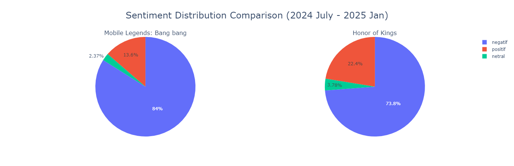

#### Mobile Legends: Bang Bang
- **Negative**: 84% 😢
- **Positive**: 13.6% 😊
- **Neutral**: 2.37% 😐

#### Honor of Kings
- **Negative**: 73.8% 😢
- **Positive**: 22.4% 😊
- **Neutral**: 3.78% 😐

#### Key Insights 🔍
1. **Honor of Kings Shows Better Vibes**: More positive feedback at 22.4% compared to MLBB's 13.6% 📈
2. **Both Face Challenges**: High negative feedback, with MLBB showing more concerns 📉
3. **Strong Opinions Rule**: Low neutral feedback suggests passionate user base 🎯

### 2. Unigram Analysis 📝

#### Mobile Legends: Bang Bang
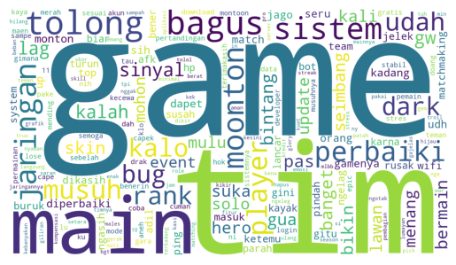
*WordCloud Unigram in MLBB* 🌟

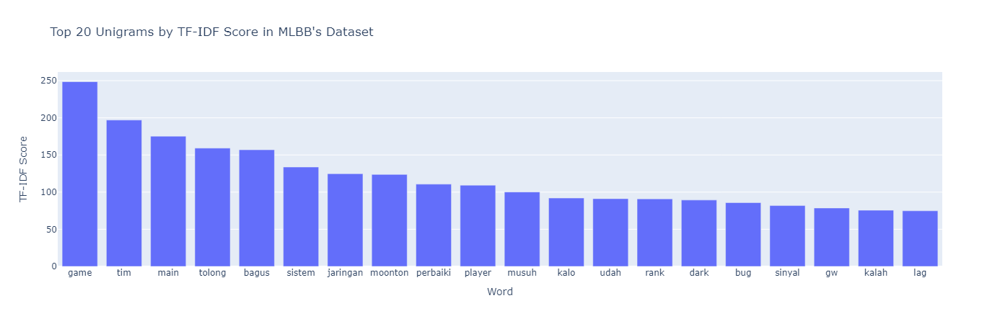
*Barplot of Unigram of MLBB* 📊

#### Honor of Kings
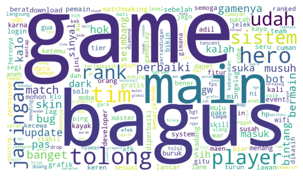
*WordCloud Unigram in HoK* 🌟

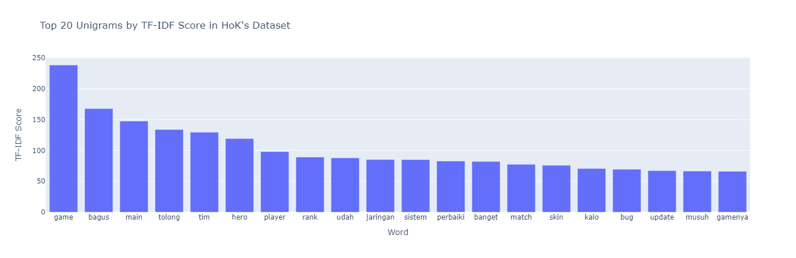
*Barplot of Unigram in HoK* 📊

##### Insights 💡
Both games show different user focus areas - MLBB faces technical challenges while HoK receives more diverse feedback about gameplay and cosmetic features! 🎮

### 3. Bigram Analysis 🔤

#### Mobile Legends: Bang Bang
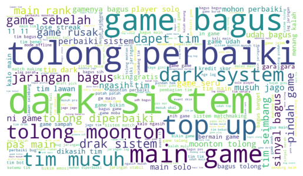
*WordCloud Bigram in MLBB* ✨

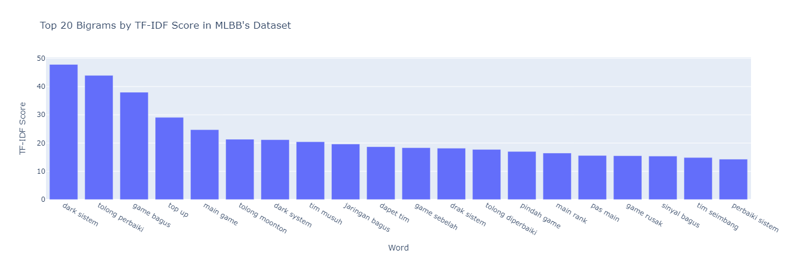
*Barplot of Bigram of MLBB* 📈

#### Honor of Kings
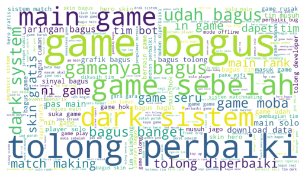
*WordCloud Bigram in HoK* ✨

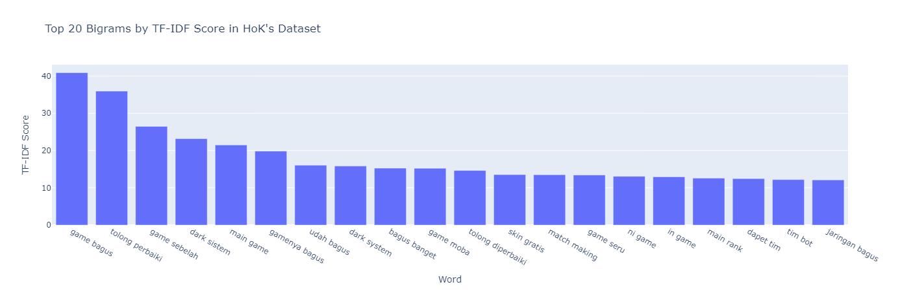
*Barplot of Bigram of HoK* 📈

##### Insights 🧐
The highest TF-IDF scores tell different stories: MLBB's "dark sistem" vs HoK's "game bagus" shows a clear contrast in user experience! 🎯

### 4. Trigram Analysis 📚

#### Mobile Legends: Bang Bang
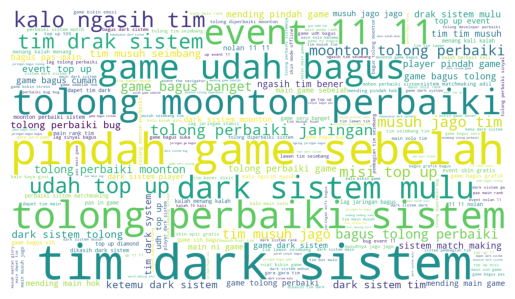
*WordCloud Trigram in MLBB* 💫

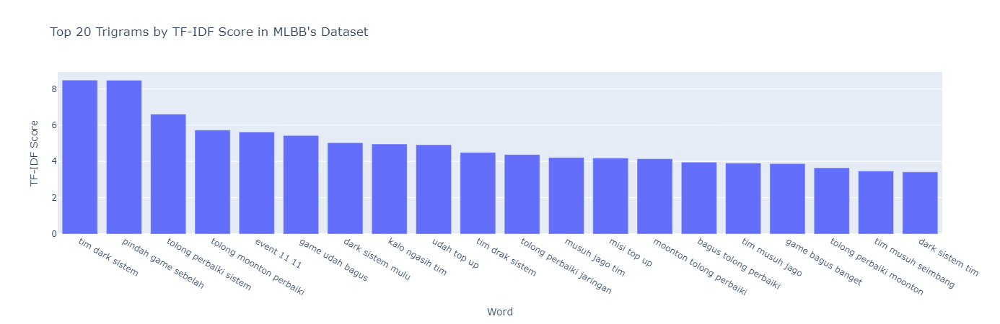
*Barplot of Trigram of MLBB* 📊

#### Honor of Kings
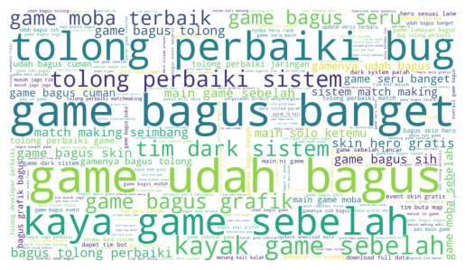
*WordCloud Trigram in HoK* 💫

*Barplot of Trigram of HoK* 📊

##### Insights 🔍
MLBB's "tim dark sistem" versus HoK's "game udh bagus" shows a striking contrast in user satisfaction! 🎮

## Conclusions and Recommendations 🎯

### Key Findings 🔑
1. **User Satisfaction** 😊
   - HoK leads in positive sentiment
   - MLBB faces more technical challenges

2. **Core Issues** ⚠️
   - MLBB: Technical stability and system fairness
   - HoK: Better balanced features and experience

3. **User Retention** 🎯
   - MLBB shows risk of user migration
   - HoK demonstrates stronger user loyalty

### Recommendations 💡

#### For Mobile Legends: Bang Bang 🚀
- Fix technical stability ASAP! 🔧
- Review monetization approach 💰
- Improve team balancing ⚖️
- Better communication with users 📢

#### For Honor of Kings 🌟
- Keep expanding successful features 🎮
- Maintain the positive momentum 📈
- Balance free and premium content 💎
- Build on user satisfaction 🏆

### Future Research Opportunities 🔮
- Long-term sentiment tracking 📊
- Monetization impact study 💰
- Feature-specific analysis 🎯
- User retention deep dive 🎮

---
*Note: This analysis reflects user feedback data and may not represent all players. Keep monitoring for more insights! 📈*